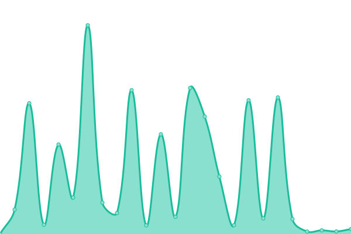
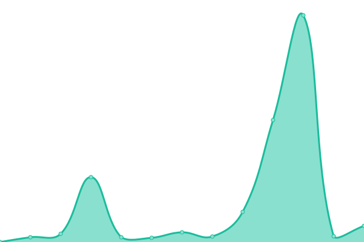

# [📈 Live Status](https://uptime.manjaro.download): <!--live status--> **🟩 All systems operational**

This repository contains the open-source uptime monitor and status page for [Manjaro Contrib](https://uptime.manjaro.download), powered by [Upptime](https://github.com/upptime/upptime).

With [Upptime](https://upptime.js.org), you can get your own unlimited and free uptime monitor and status page, powered entirely by a GitHub repository. We use [Issues](https://github.com/manjaro-contrib/upptime/issues) as incident reports, [Actions](https://github.com/manjaro-contrib/upptime/actions) as uptime monitors, and [Pages](https://uptime.manjaro.download) for the status page.

<!--start: status pages-->
<!-- This summary is generated by Upptime (https://github.com/upptime/upptime) -->
<!-- Do not edit this manually, your changes will be overwritten -->
<!-- prettier-ignore -->
| URL | Status | History | Response Time | Uptime |
| --- | ------ | ------- | ------------- | ------ |
|  [Manjaro](https://manjaro.org) | 🟩 Up | [manjaro.yml](https://github.com/manjaro-contrib/upptime/commits/HEAD/history/manjaro.yml) | 

 792ms
     
 | 

<a href="https://status.manjaro.org/history/manjaro">100.00%</a>
    

|  [Manjaro Forum](https://forum.manjaro.org) | 🟩 Up | [manjaro-forum.yml](https://github.com/manjaro-contrib/upptime/commits/HEAD/history/manjaro-forum.yml) | 

 886ms
     
 | 

<a href="https://status.manjaro.org/history/manjaro-forum">100.00%</a>
    

|  [Manjaro Wiki](https://wiki.manjaro.org) | 🟩 Up | [manjaro-wiki.yml](https://github.com/manjaro-contrib/upptime/commits/HEAD/history/manjaro-wiki.yml) | 

 3286ms
     
 | 

<a href="https://status.manjaro.org/history/manjaro-wiki">76.92%</a>
    

|  [Manjaro Packages](https://packages.manjaro.org) | 🟩 Up | [manjaro-packages.yml](https://github.com/manjaro-contrib/upptime/commits/HEAD/history/manjaro-packages.yml) | 

 1186ms
     
 | 

<a href="https://status.manjaro.org/history/manjaro-packages">100.00%</a>
    

|  [Manjaro Repo](https://repo.manjaro.org) | 🟩 Up | [manjaro-repo.yml](https://github.com/manjaro-contrib/upptime/commits/HEAD/history/manjaro-repo.yml) | 

 692ms
     
 | 

<a href="https://status.manjaro.org/history/manjaro-repo">100.00%</a>
    

|  [Manjaro Mirror](https://mirrors.manjaro.org/repo/state) | 🟩 Up | [manjaro-mirror.yml](https://github.com/manjaro-contrib/upptime/commits/HEAD/history/manjaro-mirror.yml) | 

 513ms
     
 | 

<a href="https://status.manjaro.org/history/manjaro-mirror">100.00%</a>
    

|  [Manjaro GitLab](https://gitlab.manjaro.org) | 🟩 Up | [manjaro-git-lab.yml](https://github.com/manjaro-contrib/upptime/commits/HEAD/history/manjaro-git-lab.yml) | 

 983ms
     
 | 

<a href="https://status.manjaro.org/history/manjaro-git-lab">100.00%</a>
    

|  [Manjaro Sway](https://manjaro-sway.download) | 🟩 Up | [manjaro-sway.yml](https://github.com/manjaro-contrib/upptime/commits/HEAD/history/manjaro-sway.yml) | 

 296ms
     
 | 

<a href="https://status.manjaro.org/history/manjaro-sway">100.00%</a>
    

|  [Manjaro Sway Packages](https://packages.manjaro-sway.download) | 🟩 Up | [manjaro-sway-packages.yml](https://github.com/manjaro-contrib/upptime/commits/HEAD/history/manjaro-sway-packages.yml) | 

 302ms
     
 | 

<a href="https://status.manjaro.org/history/manjaro-sway-packages">100.00%</a>
    

<!--end: status pages-->

[**Visit our status website →**](https://uptime.manjaro.download)

## 📄 License

- Powered by: [Upptime](https://github.com/upptime/upptime)
- Code: [MIT](./LICENSE) © [Manjaro Contrib](https://uptime.manjaro.download)
- Data in the `./history` directory: [Open Database License](https://opendatacommons.org/licenses/odbl/1-0/)
